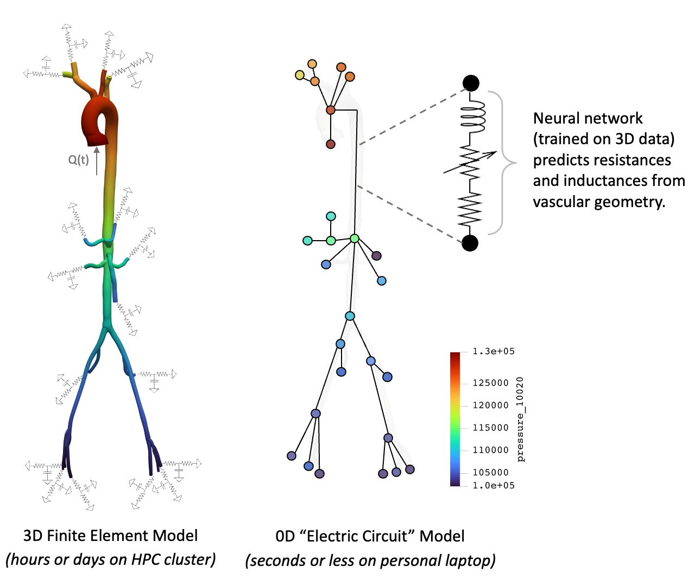

# Learned Lumped-Parameter Networks

This repository contains functionality to train and deploy neural networks that predict lumped parameters (e.g. resistances, inductances) for 0D "electric circuit" models of cardiovascular flows.  The neural networks predict lumped parameters from the vascular geometry and are trained on high-fidelity 3D data.  This work is described in greater detail in this [paper](https://arxiv.org/abs/2604.01549).  A second, more lightweight repo, [learnedZeroD](https://github.com/natalia-rubio/learnedZeroD), provides functionality to convert a standard 0D model of a vasculature into the more accurate learned representation using pre-trained neural networks.

** Documentation + production readiness in progress **



## Requirements

- **Python** 3.10 or newer
- **Python packages** (see Setup): core scientific stack plus **JAX**, **Optax**, and **dill** for training; **VTK** (`vtk` on PyPI) for geometric processing; **SciPy**,**matplotlib**, **pandas**.
- **`svzerodsolver`** and **`svzerodcalibrator`** binaries on `PATH`.  These applications are both supported by the repo [svZeroDSolver](https://github.com/SimVascular/svZeroDSolver).  Currently, this workflow is only compatible with [my fork](https://github.com/natalia-rubio/svZeroDPlus/tree/base_w_feat).


## Setup

Clone the repository and work from the repo root so imports like `util.*` resolve (scripts assume `REPO_ROOT` on `sys.path`).

```bash
git clone <YOUR_FORK_OR_REMOTE_URL> learn_lpns
cd learn_lpns

python3 -m venv .venv
source .venv/bin/activate   # Windows: .venv\Scripts\activate

pip install --upgrade pip
# JAX first (CPU/GPU variants): https://docs.jax.dev/en/latest/installation.html
pip install -U "jax[cpu]"
pip install -r requirements.txt

# Run modules from repo root, e.g.:
python -m util.zerod_calibration.batch_generate_zerod_inputs_vmr --help
python util/zerod_calibration/run_cross_validation.py --help
```

**Notes**

- **`requirements.txt`** lists packages other than JAX; install **`jax[cpu]`** or a CUDA variant before `-r requirements.txt` so jax/jaxlib stay matched.
- Point **`PATH`** at your **svZeroDPlus** / solver install when running calibration or forward simulation steps.


## Functionality

The central workflow of this repo is as follows:

1. Pre-process 0D geometry and extract geometric features,
2. Find "ground truth" lumped paramters by calibration to 3D simulation data,
3. Train neural networks (NNs) to predict lumped parameters from geometric features,
4. Test the forward-simulation performace of 0D models with neural-network-predicted parameters.

$k$-fold cross-validation of this workflow is implemented, where $k$ different train and test sets are considered.  Scripts for visualizations are also provided.  

## Repository layout

| Path | Purpose |
|------|---------|
| `util/zerod_calibration/` | Core 0D pipeline: geometry pre-processing (split junctions with 3+ outlets into bifurcations, adjust junction-vessel boundaries based on a pseudo entrance length), calibration, forward simulation, CV orchestration (`run_cross_validation.py`), and run-config handling. |
| `util/neural_network/` | JAX/Optax model definitions, utilities, training launcher, and training loop for predicting lumped parameters from geometric features. |
| `util/data_processing/` | Builds ML-ready tables and JAX arrays from generated 0D outputs; creates split indices and helper summaries. |
| `util/visualizations/` | Plotting and reporting scripts for CV metrics, calibration diagnostics, and geometry/result inspection. |
| `util/cluster_scripts/` | Cluster helpers for centerline projection, VTU processing, and large-scale data generation workflows. |
| `util/tools/` | Shared lightweight utilities used across modules (e.g., dictionary save/load wrappers). |
| `data/` | Generated/working datasets (`zeroD`, `ml_inputs`, `jax_arrays`, `split_indices`) organized by set name and optional run-config suffix. |
| `results/` | Model artifacts and evaluation outputs (`results/models/...`, `results/cross_validation/...`). |
| `requirements.txt` | Python dependency list (install JAX separately first to match your platform/CUDA stack). |
| `README.template.md` | Project documentation template and onboarding notes for local setup/workflow. |

## Usage

Run from the **repository root** so imports and `--data-root data` resolve as expected.

### Quick start (cross-validation)

This command exercises most of the pipeline: prerequisite checks, k-fold training (junction + vessel NNs), NN deploy on validation geometries, MSE aggregation, summary CSVs, and pressure-error barcharts.

```bash
python util/zerod_calibration/run_cross_validation.py \
  VMR_rigid_aorta_adults_all \
  bifurcations_EL \
  2 \
  --run-config stenosis_off_symmetric_gen_loss
```

Positional arguments: `<set_name> [geometry_variant] [num_trials]`. Defaults: `geometry_variant=bifurcations_EL`, `num_trials=5`.

### Run config (`--run-config`)

Physics and training variants are selected with a single **`--run-config`** flag on the zerod CLIs, CV, batch, and data processing. Tokens are **underscore-separated** and **order-independent**; they are resolved to a canonical path suffix under `data/` and `results/`.

Examples (all equivalent for paths):

```text
gen_loss_penalty_off_symmetric  →  symmetric_penalty_off_gen_loss
symmetric_penalty_off_gen_loss  →  symmetric_penalty_off_gen_loss  (passthrough)
stenosis_off_symmetric_gen_loss →  stenosis_off_symmetric_gen_loss
```

Tokens: `normalized`, `stenosis_off`, `symmetric`, `penalty_off`, `gen_loss`. `stenosis_off` and `penalty_off` cannot be combined. Default when omitted: `stenosis_off_symmetric_gen_loss`.

On-disk layout (when run-config is set):

```text
data/zeroD/<set_name>/<run_config>/<geo_id>/...
data/ml_inputs/<set_name>/<run_config>/<geometry_variant>/<geo_id>/...
data/jax_arrays/<set_name>/<run_config>/<geometry_variant>/<set_type>/...
data/split_indices/<set_name>/<run_config>/...
results/models/<set_name>/<run_config>/...
results/cross_validation/<set_name>/<run_config>/...
```

Implementation: `util/zerod_calibration/run_config_canonical.py` (token parsing, composition, flag derivation) and `util/zerod_calibration/generate_zerod_inputs_cli.py` (shared argparse for single-geo and batch entry points).

### Batch 0D generation (`batch_generate_zerod_inputs_vmr.py`)

Runs `generate_zerod_inputs.py` over VMR geometries discovered from `data/zeroD/<set_name>/richter-0d/`.

```bash
python -m util.zerod_calibration.batch_generate_zerod_inputs_vmr \
  --set-name VMR_rigid_aorta_adults \
  --run-config gen_loss_penalty_off_symmetric \
  --skip-steps calibration_forward \
  --geometries 0076_1001
```

**`--skip-steps`** — skip pipeline stages without separate flags. Tokens (order-independent): `base_generation`, `observation`, `calibration`, `forward`, `mse`, `plots`. Example: `base_generation_observation_calibration` or `calibration_forward`.

Other useful flags: `--no-redo` (skip recreating files that already exist), `--NN-only`, `--NN-vessel`, `--skip-existing` (skip geometries that already have full outputs including NN forward results).

### k-fold cross-validation (`run_cross_validation.py`)

Each trial randomly splits geometries into train vs validation sets, trains the junction NN (and vessel NN unless disabled), deploys with `generate_zerod_inputs.py --NN-only` on validation geometries, and aggregates MSE from each geometry’s `mse_comparison.csv`. When CV finishes, **`cv_pressure_max_pct_error_barchart`** runs automatically (all three pressure metrics) unless you pass **`--skip-barchart`**.

**What CV regenerates**

| Stage | When | What runs |
|-------|------|-----------|
| **Bootstrap** (start) | Only if prerequisites are missing | `batch_generate_zerod_inputs_vmr` + `run_data_processing` |
| **Per trial** | Always (val geometries) | `generate_zerod_inputs --NN-only` (NN inference, forward sim, MSE, plots) |

Bootstrap runs only when **any** of the following is true for the run-config:

- ml_inputs missing (`geometric_features.csv` / `junction_lumped_parameters.csv`) for some geometry
- jax pickle missing for the cohort size
- **calibrated** zeroD incomplete (missing calibrated JSON/CSV) — **not** missing NN forward files (those are created per trial at deploy)

When bootstrap runs, batch processes **only the missing geometries**, not the whole cohort. Data processing uses all geometries if jax must be rebuilt, otherwise only the batch subset.

- **`--no-redo`**: passed to bootstrap batch only; skips recreating zeroD files that already exist. Does not affect per-trial NN deploy (deploy does not pass `--no-redo`, so NN forward outputs are refreshed each trial).
- **`--skip-training-if-exists`**: skip training for a trial if model checkpoints already exist.
- **`--trial N`**: re-run only trial `N` (0-based); merges into existing summary CSV.
- **`--metrics-only`**: rebuild summary CSVs from existing per-geometry MSE files (no train/deploy); still runs barcharts unless `--skip-barchart`.
- **`--plots-only`**: regenerate location comparison plots from existing zeroD data.

**Outputs:** per-trial models under `results/models/<set_name>/<run_config>/…_trial_<k>/`, split pickles under `data/split_indices/…`, summary CSVs under `results/cross_validation/<set_name>/<run_config>/` (including pressure/flow MSE and max-error variants), and barchart PDFs in the same directory (e.g. `bifurcations_EL_max_pct_error.pdf`).

### Multiple configs

`run_cv_all_configs.py` runs CV over several run-configs in sequence, then by-config comparison barcharts. CV already generates per-config barcharts; use `--skip-per-config-barchart` on that wrapper to disable them.

```bash
python -m util.zerod_calibration.run_cv_all_configs VMR_rigid_aorta_adults bifurcations_EL 5
```

### Data processing

After zeroD outputs exist, build ml_inputs and jax stacks:

```bash
python util/data_processing/run_data_processing.py \
  --set-name VMR_rigid_aorta_adults_all \
  --geometry-variant bifurcations_EL \
  --run-config stenosis_off_symmetric_gen_loss
```

Feature histograms and related paths follow the same `set_name / run_config / geometry_variant` layout as jax arrays.


## Data

The `data/` directory is organized by `set_name` (the cohort of vascular geometries use for training and testing, e.g. VMR_abdo - abdominal aortas from the Vascular Model Repository), `geometry_id` (each geometry in the cohort), and (optionally) `run_config` suffix.


- `zeroD/`: per-geometry simulation workspace and outputs (generated geometric inputs, calibrated configs, forward-simulation result CSVs, downsampled CSVs, and MSE comparison files). VMR cohorts use `data/zeroD/<set_name>/richter-0d/` for input JSONs; centerlines for VMR live under `data/oneD/VMR/<geo_id>/unsteady_soln.vtp`.
- `oneD/`: per-geometry 3D solutions projected onto 1D centerlines by integration over vessel cross-sections.  Used to calibrate the 0D model to find the ground truth lumped parameter values.  (Needs to be provided by user.  Sample script to project a 3D solution onto centerline in `util/cluster_scripts`.)
- `ml_inputs/`: per-geometry tabular features/targets extracted from `zeroD/` outputs for machine-learning training (e.g., geometric features and lumped-parameter labels).
- `jax_arrays/`: stacked, serialized arrays built from `ml_inputs/` for fast JAX training/inference; also stores vessel-mode arrays when enabled.
- `split_indices/`: saved train/validation geometry splits for reproducible CV trials (`trial_k` split files and matching geometry name lists).

## Results

The `results/` directory holds **trained models, cross-validation summaries, and derived plots or tables** produced by the pipeline and reporting utilities—the complement to `data/`, which stores inputs and intermediate datasets.  Paths usually follow `set_name`, an optional `run_config` suffix (matching `data/` and the CLI default), and sometimes `geometry_variant` or a CV trial index.

- `models/`: saved junction and vessel neural network checkpoints and metadata, commonly laid out as `…/<set_name>/<run_config>/…_trial_<k>/` for k-fold cross-validation.
- `cross_validation/`: aggregated metrics across trials and barchart PDFs per run-config.
- Script-specific outputs: `location_comparison/` (pressure/flow vs time), `param_comparison/` (geometric vs calibrated vs NN parameters), and `feature_histograms/` under `data/feature_histograms/<set_name>/<run_config>/<geometry_variant>/<set_type>/`.

