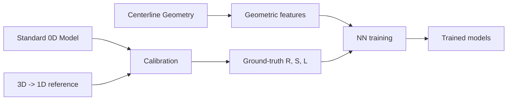
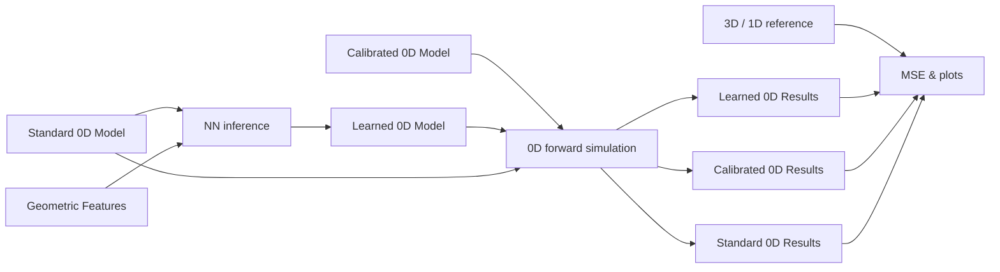

# Learned Lumped-Parameter Networks

This repository contains functionality to train and deploy neural networks that predict lumped parameters (e.g. resistances, inductances) for 0D "electric circuit" models of cardiovascular flows.  The neural networks predict lumped parameters from the vascular geometry and are trained on high-fidelity 3D data.  This work is described in greater detail in this [paper](https://arxiv.org/abs/2604.01549).  A second, more lightweight repo, [learnedZeroD](https://github.com/natalia-rubio/learnedZeroD), provides functionality to convert a standard 0D model of a vasculature into the more accurate learned representation using pre-trained neural networks.

## Pipeline Overview

The workflow has two modes:

**Training** — Extract geometric features from the centerline geomtry (neural net inputs).  Use the calibrator to extract optimal (ground-truth) resistances and inductances (R, S, L) values for the 0D cirucit analog model from 3D solution (via `svzerodcalibrator`).  Train a neural network to learn the relationship between the two.

**Inference** — Use trained networks to predict resistances and inductances (R, S, L) values for an unseen geometry, run 0D forward simulation on the "learned" 0D model, and compare the results to the 3D reference, as well as the 0D simulation results for the standard model (baseline) and calibrated model (best possible).

$k$-fold cross-validation splits geometries into train/validation sets across multiple trials. Visualization scripts summarize metrics and diagnostics.

### Training




### Deployment




### Inputs:

- **1D centerline solution file (vtp)**: This file contains a 1D centerline representation of the geometry and the 3D simulation results projected onto the 1D centerline.  The 1D geometry vtp file for a patient-specific anatomy can be generated with the [SimVascular ROM Simulation Tool](https://simvascular.github.io/documentation/rom_simulation.html).  3D simulation results can be projected onto the centerline by integration over centerline-normal cross sections, example code [here](https://github.com/natalia-rubio/projection_scripts_3d_1d).
- **Standard 0D input file (json)**: This file contains the standard SimVascular 0D representation of the vasculature and the simulation boundary conditions.  The 0D input file can also be generated with the [SimVascular ROM Simulation Tool](https://simvascular.github.io/documentation/rom_simulation.html).

### Outputs:

- `learn-lpns-batch-zerod`:
  - Augmented 0D input files: contain extra geometric information and modified junction-vessel discretization (saved in `data/zeroD`)
  - Calibrated 0D input files: contains the optimal (ground truth) resistances and inductances (saved in `data/zeroD`)
  - Tabulated geometry (neural network features) and lumped parameter (neural network target) data, saved in human-readable csvs (`data/ml_inputs`)and pickled dictionaries of jax arrays (`data/jax_arrays`).  Train-validation splits also generated.  (Can be generated independently with `learn-lpns-data-processing`, run `learn-lpns-batch-zerod` first.)
  - Learned 0D input files: contains neural-network predicted resistances and inductances (saved in `data/zeroD`).  Generated only if trained neural networks are available (`learn-lpns-train` has been run).
  - Forward 0D simulation results:  Flow and pressure results generated for standard, calibrated, and learned input files, as available.  csv files containing results for each 0D node at each timestep, plots of each solution (compared to the 3D solution) in time at a specified (generally inlet) node.  Printed table listing inlet pressure MSE with respect to 3D simulation.
- `learn-lpns-train`: Trained neural networks.
- `learn-lpns-cv`: k-fold cross-validation; summary CSVs and barcharts saved to `results/cross_validation`. Before trials run, generates any missing prerequisite files for the cohort (calibrated zeroD JSONs, `ml_inputs`, `jax_arrays`, train/val splits). Each trial trains NNs and runs inference on held-out geometries, producing the forward-simulation and MSE outputs above where applicable.

## Requirements

- **Python** 3.10+
- **Packages:** JAX, Optax, NumPy, pandas, SciPy, matplotlib, VTK, dill (see Setup)
- **Binaries:** `svzerodsolver` and `svzerodcalibrator` — built from [svZeroDPlus fork](https://github.com/natalia-rubio/svZeroDPlus/tree/J-J_wiring) (`J-J_wiring` branch) via `scripts/setup_cross_validation.sh`

## Setup

Sample data under `data/` uses **Git LFS** (~70 MB of VTP/JSON). After clone:

```bash
brew install git-lfs && git lfs install && git lfs pull
# or: ./scripts/setup_git_lfs.sh
```

```bash
# One-shot (macOS: brew install cmake python@3.12 first)
PYTHON=$(brew --prefix python@3.12)/bin/python3.12 ./scripts/setup_cross_validation.sh
source scripts/cv_env.sh
```


## Quick start

```bash
./scripts/setup_cross_validation.sh
source scripts/cv_env.sh
learn-lpns-cv --set_name VMR_aortas --geometry_variant bifurcations_EL --num_trials 2 --run_config gen_loss
```

```bash
pytest -v    # unit tests, no C++ solver required
```

## Examples

**[examples/nn_parameter_comparison.ipynb](examples/nn_parameter_comparison.ipynb)** — This notebook demonstrates a smaller, but representative workflow that does not include the calibration or forward simulation steps, which require the external binaries `svzerodcalibrator` and `svzerodsolver`.

```bash
make notebook
```

## Documentation


| Guide                                                                            | Contents                                                                                                            |
| -------------------------------------------------------------------------------- | ------------------------------------------------------------------------------------------------------------------- |
| [docs/usage.md](docs/usage.md)                                                   | Run config, batch generation, CV, training, visualizations                                                          |
| [docs/architecture.md](docs/architecture.md)                                     | Design decisions                                                                                                    |
| [CONTRIBUTING.md](CONTRIBUTING.md)                                               | Setup, checks                                                                                                       |
| [docs/data_and_results.md](docs/data_and_results.md)                             | Data layout, sample cohort, output paths                                                                            |
| [data/README.md](data/README.md)                                                 | Provided VMR_aortas cohort, inputs needed for example notebook                                                      |
| [examples/nn_parameter_comparison.ipynb](examples/nn_parameter_comparison.ipynb) | Notebook: Representative workflow skipping steps that require external svzerodsolver and svzerodcalibrator binaries |


## Repository layout

```
learn_lpns/                          # installable Python package
├── zerod_calibration/               # 0D preprocessing, calibration, forward sim, CV
│   ├── run_cross_validation.py      # → learn-lpns-cv
│   ├── batch_generate_zerod_inputs_vmr.py  # → learn-lpns-batch-zerod
│   ├── generate_zerod_inputs.py       # core per-geometry 0D pipeline
│   ├── geometric_params.py            # extract_and_add_geometric_params (centerline → config)
│   ├── calibration.py               # svzerodcalibrator wrapper
│   ├── forward_simulation.py        # svzerodsolver wrapper
│   ├── nn_inference.py              # junction/vessel NN prediction
│   ├── run_config_canonical.py      # --run_config token parsing
│   └── tools/
│       ├── file_io.py               # path helpers, VTK/JSON I/O
│       └── svzerod_binaries.py      # locate C++ solver binaries
├── data_processing/                 # → learn-lpns-data-processing
│   ├── run_data_processing.py       # ml_inputs + jax_arrays from zeroD
│   └── generate_split_indices.py    # geometry-level train/val splits
├── neural_network/                  # → learn-lpns-train
│   ├── launch_training.py           # training CLI
│   ├── train_nn.py                  # Optax training loop
│   └── nn_model.py                  # JAX model definitions
├── visualizations/                  # CV barcharts, LaTeX tables, diagnostics
└── tools/
    └── basic.py                     # shared dict I/O helpers

data/                                # provided seed inputs + generated artifacts
├── zeroD/                           # 0D JSON configs and simulation outputs
├── oneD/                            # 1D centerline VTPs (3D projected)
├── ml_inputs/                       # feature/label CSVs
├── jax_arrays/                      # pickled JAX training arrays
└── split_indices/                   # CV train/val geometry splits

results/                             # gitignored outputs
├── models/                          # trained NN checkpoints
└── cross_validation/                # CV summary CSVs and barchart PDFs

config/                              # pipeline defaults (physics, solver, calibration, splits, training)
tests/                               # unit tests (no C++ solver)
scripts/                             # environment setup (setup_cross_validation.sh)
docs/                                # usage, architecture, data layout
assets/                              # README figures
```

See [data/README.md](data/README.md) for provided sample cohort paths.

## Console entry points


| Command                      | Purpose                        |
| ---------------------------- | ------------------------------ |
| `learn-lpns-cv`              | k-fold cross-validation        |
| `learn-lpns-batch-zerod`     | Batch 0D generation            |
| `learn-lpns-data-processing` | Build ml_inputs and jax arrays |
| `learn-lpns-train`           | Train junction/vessel NNs      |


## Configuration

The repo uses two related config layers:

**Pipeline defaults (YAML)** — physics, solver tolerances, calibration penalties, train/val splits, and NN training hyperparameters live in `config/defaults.yaml`. Load them in code with `get_pipeline_config()` (optionally pass `set_name` to deep-merge `config/sets/<set_name>.yaml` when present). Override the base file with the `LEARN_LPNS_CONFIG` environment variable, or pass a dict of patches in tests.

**Run config (CLI)** — experiment variants are selected with `--run_config` on the console entry points (default: `gen_loss`). Tokens such as `quadratic_resistor`, `penalty_on`, and `asymmetric_loss` are underscore-separated and order-independent; they resolve to a canonical suffix under `data/` and `results/` (e.g. `data/zeroD/VMR_aortas/gen_loss/`). See [docs/usage.md](docs/usage.md) (`Run config`) and `learn_lpns/zerod_calibration/run_config_canonical.py`.

**Imports** — Small top-level API for notebooks and downstream tools:

```python
from learn_lpns import get_pipeline_config, resolve_run_config_suffix, modality_table_header
```
