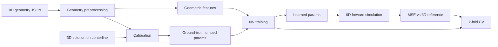

# Architecture

## Pipeline

The central workflow:

1. Pre-process 0D geometry and extract geometric features
2. Find ground-truth lumped parameters by calibration to 3D simulation data
3. Train neural networks to predict lumped parameters from geometric features
4. Test forward-simulation performance of 0D models with NN-predicted parameters

$k$-fold cross-validation splits geometries into train/validation sets across multiple trials. Visualization scripts summarize metrics and diagnostics.

## Design decisions

- **Separate R / S / L networks** — Each RRI coefficient (linear resistor, stenosis resistor, inductor) is a single-output network with its own learning rate and architecture (`training.rri_coefficients` in `config/defaults.yaml`). This allows per-coefficient asymmetric loss weights and avoids one output dominating training.
- **Geometry-level CV splits** — Train/validation splits assign whole geometries, not individual junction rows, so validation measures generalization to unseen vasculatures.
- **Canonical `--run_config` paths** — Underscore tokens (e.g. `gen_loss`, `quadratic_resistor`) compose a single on-disk suffix under `data/` and `results/`, keeping physics variants and training modes reproducible without ad-hoc folder names (`run_config_canonical.py`).
- **Bootstrap-on-missing** — Cross-validation only regenerates prerequisites that are absent (calibrated zeroD, ml_inputs, jax pickles), reducing rerun cost.

## Tradeoffs

- **External C++ solver** — Calibration and forward simulation call `svzerodsolver` / `svzerodcalibrator` (fork on `J-J_wiring`). This keeps physics in a validated solver but adds a build step; unit tests cover pure Python logic only.
- **JAX for training** — Functional, JIT-compiled training with Optax; JAX must be installed separately to match CPU/GPU platform.
- **Bundled sample size** — Five geometries demonstrate the full pipeline locally; paper-scale cohorts require user-provided data under the same layout.
